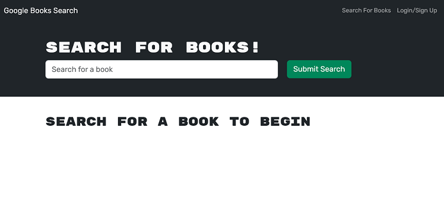
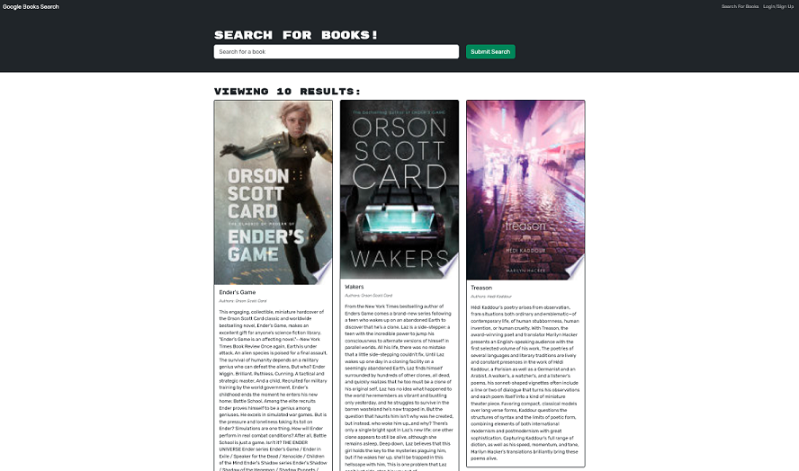
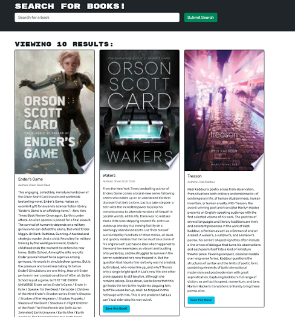
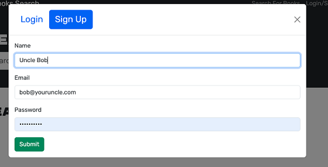
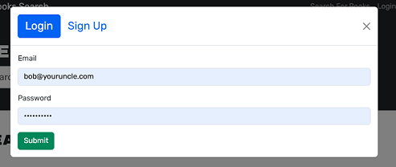
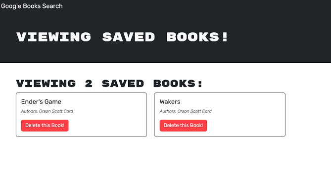

# MERN: Book Search Engine


## Preface:

Working with starter code for a fully functioning Google Books API search engine built with a RESTful API, refactor it to be a GraphQL API built with Apollo Server. The app was built using the MERN stack with a React front end, MongoDB database, and Node.js/Express.js server and API. It's already set up to allow users to save book searches to the back end.

- Set up an Apollo Server to use GraphQL queries and mutations to fetch and modify data, replacing the existing RESTful API.

- Modify the existing authentication middleware so that it works in the context of a GraphQL API.

- Create an Apollo Provider so that requests can communicate with an Apollo Server.

- Deploy your application to Render with a MongoDB database using MongoDB Atlas.

## Table of Contents

- [General Functionality](#general-functionality)
- [Screenshots](#screen-shots)
- [Installation](#installation)
- [Usage](#usage)
- [Credits](#credits)
- [License](#licensing)
- [Contributing](#contributing)

### General Functionality

```
GIVEN a book search engine
WHEN I load the search engine
THEN I am presented with a menu with the options Search for Books and Login/Signup and an input field to search for books and a submit button
WHEN I click on the Search for Books menu option
THEN I am presented with an input field to search for books and a submit button
WHEN I am not logged in and enter a search term in the input field and click the submit button
THEN I am presented with several search results, each featuring a book’s title, author, description, image, and a link to that book on the Google Books site
WHEN I click on the Login/Signup menu option
THEN a modal appears on the screen with a toggle between the option to log in or sign up
WHEN the toggle is set to Signup
THEN I am presented with three inputs for a username, an email address, and a password, and a signup button
WHEN the toggle is set to Login
THEN I am presented with two inputs for an email address and a password and login button
WHEN I enter a valid email address and create a password and click on the signup button
THEN my user account is created and I am logged in to the site
WHEN I enter my account’s email address and password and click on the login button
THEN I the modal closes and I am logged in to the site
WHEN I am logged in to the site
THEN the menu options change to Search for Books, an option to see my saved books, and Logout
WHEN I am logged in and enter a search term in the input field and click the submit button
THEN I am presented with several search results, each featuring a book’s title, author, description, image, and a link to that book on the Google Books site and a button to save a book to my account
WHEN I click on the Save button on a book
THEN that book’s information is saved to my account
WHEN I click on the option to see my saved books
THEN I am presented with all of the books I have saved to my account, each featuring the book’s title, author, description, image, and a link to that book on the Google Books site and a button to remove a book from my account
WHEN I click on the Remove button on a book
THEN that book is deleted from my saved books list
WHEN I click on the Logout button
THEN I am logged out of the site and presented with a menu with the options Search for Books and Login/Signup and an input field to search for books and a submit button
```

### Screenshots

#### Home

Search page is rendered and the user is able to search for books or login/signup.



#### Search Results (not logged in)

Search results are displayed but there is not a button to save a book.



#### Search Results (logged in)

Search results are displayed and there is a button to save a book.



#### Signup

A person has the ability to create a new account via the signup feature.
Signup creates the account and logs in as the account.



#### SignIn

The user logs in with email and password provided during signup.



#### Saved Books

The user, when logged in, can save books to their list and then view/remove items from the list.



### Installation

1.  Install Node.js version 20.x or newer
2.  Clone https://github.com/ericroys-school/mern-book-search.git
3.  `cd` into the `mern-book-search` directory
4.  Build the project: Run `npm run render-build` to load all the project dependencies and build
5.  Install or have running an instance of mongo db (latest)
6.  Add your mongo db information as `MOGODB_URI` in `.env` if running mongodb other than the default prescribed `'mongodb://127.0.0.1:27017/googlebooks'`
7.  Run `npm run start --omit=dev` to start the application
8.  Access the application on http://localhost:3001

### Usage

Please follow the installation instructions to run the program locally. The app is then available via http://localhost:3001.

While it lasts, there is a free deployment available on [Render](https://mern-book-search-nqrw.onrender.com)

Register a new user, login, and have fun.

### Credits

No kittens, wombats, pandas, otter, or octopi were harmed in the making of this project. Note: A panda did injure itself, as pandas do, because they are silly creatures.
